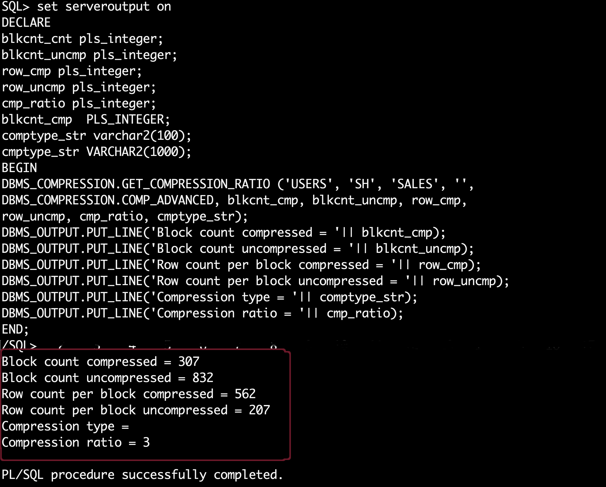

# How do I see the current table compression ratio?
Duration: 10 minutes

The DBMS_COMPRESSION package gathers compression-related information within a database environment. This includes tools for estimating compressibility of a table for both partitioned and non-partitioned tables, and gathering row-level compression information on previously compressed tables. This gives the user with adequate information to make compression-related decision. 

*GET\_COMPRESSION\_RATIO procedure analyzes the compression ratio of a table, and gives information about compressibility of a table. Various parameters can be provided by the user to selectively analyze different compression types.*

## Task 3: View Compressed and Un-compressed blocks

1. View row count of sales table under SH schema which comes along with sample schema setup
 

      ```
      <copy>
      SELECT COUNT(*) FROM SH.SALES; 
      </copy>
      ```

      Row count is 918843

2. Get tablespace name, owner from all_tables, this is optional step   

      ```
      <copy>
      select table_name, tablespace_name, owner from all_tables where table_name='SALES';  
      </copy>
      ```

      

3. Using Advisor – The GET\_COMPRESSION\_RATIO Procedure. Compression advisor typically provides fairly accurate estimates, of the actual compression results that may be obtained, after implementing compression.


      ```
      <copy>
      set serveroutput on
      DECLARE
      blkcnt_cnt pls_integer;
      blkcnt_uncmp pls_integer;
      row_cmp pls_integer;
      row_uncmp pls_integer;
      cmp_ratio pls_integer;
      blkcnt_cmp  PLS_INTEGER;
      comptype_str varchar2(100);
      cmptype_str VARCHAR2(1000);
      BEGIN
      DBMS_COMPRESSION.GET_COMPRESSION_RATIO ('USERS', 'SH', 'SALES', '',
      DBMS_COMPRESSION.COMP_ADVANCED, blkcnt_cmp, blkcnt_uncmp, row_cmp,
      row_uncmp, cmp_ratio, cmptype_str);
      DBMS_OUTPUT.PUT_LINE('Block count compressed = '|| blkcnt_cmp);
      DBMS_OUTPUT.PUT_LINE('Block count uncompressed = '|| blkcnt_uncmp);
      DBMS_OUTPUT.PUT_LINE('Row count per block compressed = '|| row_cmp);
      DBMS_OUTPUT.PUT_LINE('Row count per block uncompressed = '|| row_uncmp);
      DBMS_OUTPUT.PUT_LINE('Compression type = '|| comptype_str);
      DBMS_OUTPUT.PUT_LINE('Compression ratio = '|| cmp_ratio);
      END;
      /
      </copy>
      ```

      
   
## Learn More
* [DBMS_COMPRESSION](https://docs.oracle.com/cd/E11882_01/appdev.112/e40758/d_compress.htm )
